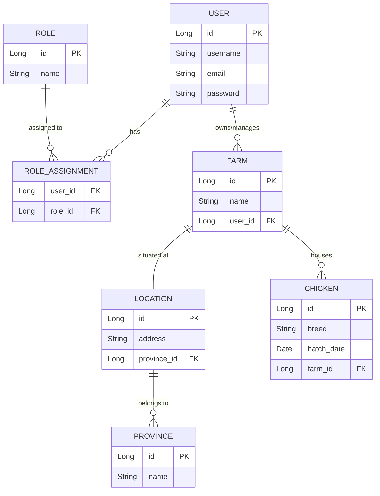

# Chicken Management System: Entity Relationship Diagram (ERD)

This document provides a comprehensive database design for a Chicken Management System, tailored for academic presentation and implementation using Spring Boot and JPA.

## 1. ERD Visualization

---

## 2. Key Definitions

### Primary Key (PK)
A **Primary Key** is a unique identifier for each record in a table. It ensures data integrity by preventing duplicate entries and allowing specific records to be targeted for updates or deletions.
*   *Example*: `USER.id` is the Primary Key for the User table.

### Foreign Key (FK)
A **Foreign Key** is a field in one table that links to the Primary Key of another table. It establishes and enforces a link between the data in the two tables, maintaining referential integrity.
*   *Example*: `FARM.user_id` points to `USER.id`, indicating which user owns the farm.

---

## 3. Relationship Explanations & Business Logic

### Many-to-Many (M:N)
**Relationship**: `User <-> Role`
*   **Business Logic**: In a robust system, a user might hold multiple responsibilities (e.g., both an "Admin" and a "Farm Manager"). Conversely, a single role (e.g., "Worker") is shared by many different users.
*   **Implementation**: Requires a join table (`ROLE_ASSIGNMENT`) containing foreign keys for both `User` and `Role`.

### One-to-Many (1:N)
**Relationship**: `User -> Farm`
*   **Business Logic**: An entrepreneur or organization (User) may own multiple physical sites (Farms). However, for accountability and management, each farm is typically assigned to one primary owner/manager.
*   **Data Integrity**: The `user_id` FK is placed in the `FARM` table.

**Relationship**: `Farm -> Chicken`
*   **Business Logic**: A farm is a containment unit that houses many individual chickens. To track inventory and health stats, each chicken must be linked to exactly one farm at a time.
*   **Data Integrity**: The `farm_id` FK is placed in the `CHICKEN` table.

**Relationship**: `Province -> Location`
*   **Business Logic**: Administrative regions are hierarchical. Many specific addresses/locations fall within the boundaries of a single province.
*   **Data Integrity**: The `province_id` FK is placed in the `LOCATION` table.

### One-to-One (1:1)
**Relationship**: `Farm <-> Location`
*   **Business Logic**: Every physical farm has one unique geographical footprint or address (Location). We separate `Location` from `Farm` to allow for specialized geo-spatial or address logic that doesn't clutter the core business details of the farm entity.
*   **Data Integrity**: One table (e.g., `FARM`) will hold a unique foreign key to the `LOCATION` table, ensuring a strict 1-to-1 mapping.

---

## 4. Academic Summary
This design follows **3rd Normal Form (3NF)** principles by:
1.  Eliminating redundant data (e.g., Provinces are not stored as text in every Location).
2.  Ensuring every non-key attribute is dependent only on the Primary Key.
3.  Utilizing standard relational mapping conventions suitable for JPA `@OneToMany`, `@ManyToOne`, `@OneToOne`, and `@ManyToMany` annotations.
